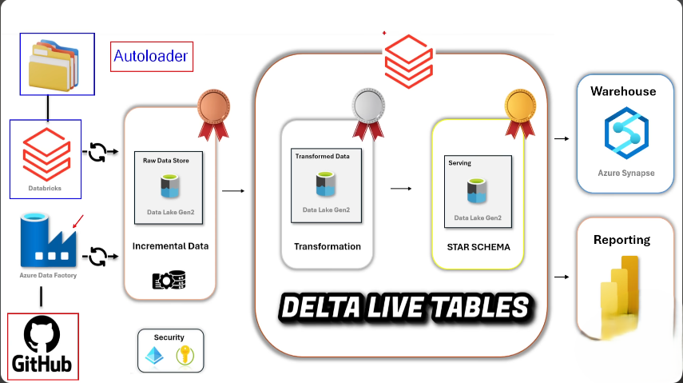
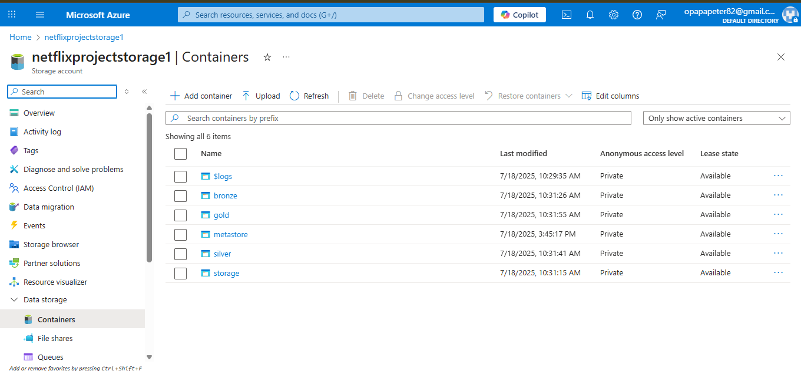
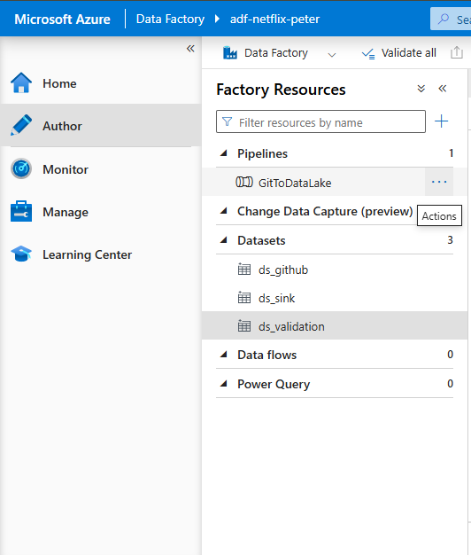
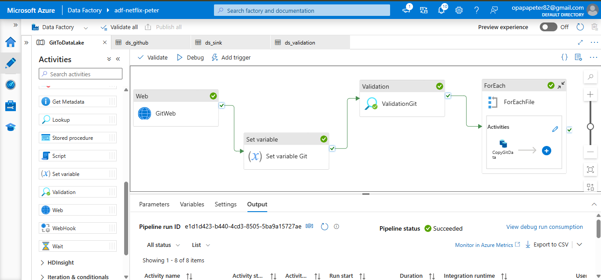
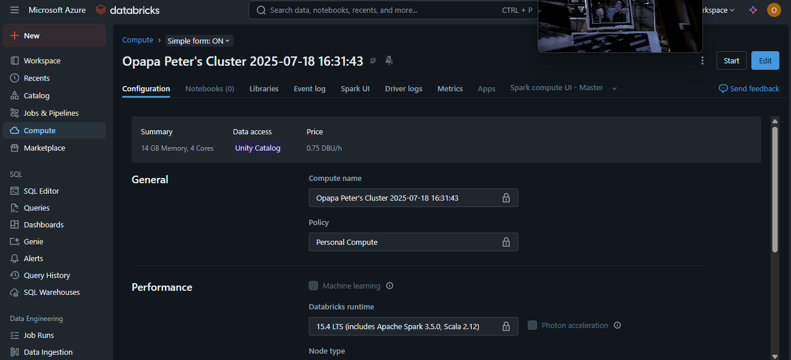
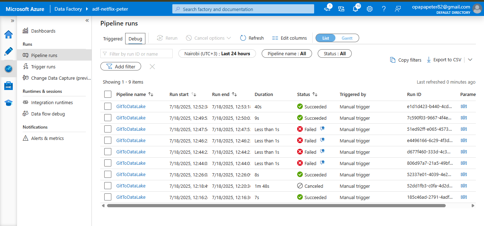
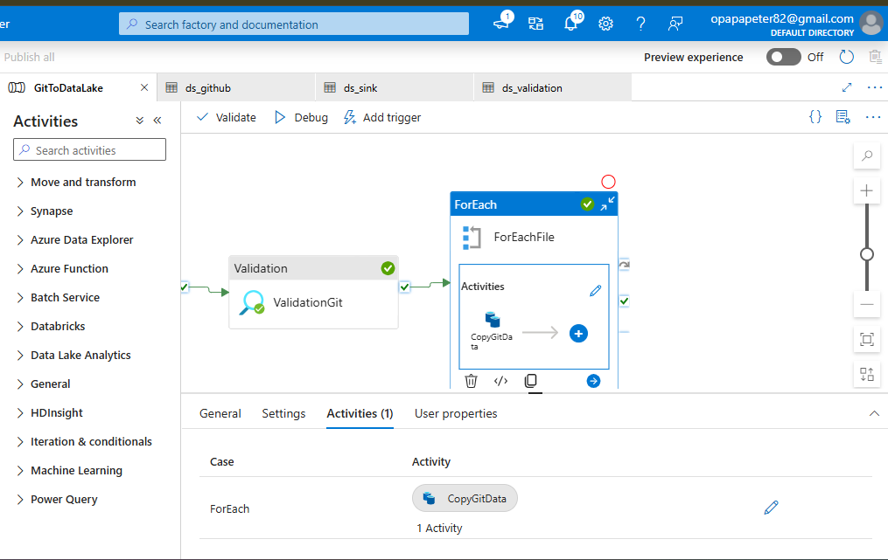

# 🎬 Netflix Data Engineering Pipeline on Azure

[](https://opensource.org/licenses/MIT)
[](https://azure.microsoft.com/)
[](https://databricks.com/)
[](https://delta.io/)

A comprehensive, production-ready data engineering solution for Netflix dataset analysis implementing modern data lakehouse architecture using Azure Data Factory, Azure Data Lake Storage Gen2, and Databricks with Delta Lake.

## 🏗️ Architecture Overview



This project implements a **medallion architecture** (Bronze → Silver → Gold) data lakehouse pattern with the following components:

### 🔄 Data Flow Architecture
- **Data Ingestion**: Azure Data Factory (ADF) orchestrates automated data ingestion from GitHub repositories to ADLS Gen2
- **Bronze Layer**: Raw data landing zone in ADLS Gen2 with Databricks Autoloader for real-time streaming ingestion
- **Silver Layer**: Cleaned, validated, and transformed data using Delta Lake tables with data quality enforcement
- **Gold Layer**: Business-ready aggregated data optimized for analytics, reporting, and machine learning



## 📁 Project Structure

```
📦 Netflix-Data-Pipeline/
├── 📚 docs/                           # Documentation and architecture diagrams
│   ├── 🖼️ images/                     # Architecture diagrams and screenshots
│   └── 🔧 setup/                      # Setup and deployment guides
├── 🏗️ infrastructure/                 # Infrastructure as Code
│   ├── 🏭 adf/                        # Azure Data Factory pipelines and configurations
│   ├── ⚡ databricks/                 # Databricks workspace configurations
│   └── 💾 storage/                    # ADLS Gen2 configurations
├── 💻 src/                           # Source code
│   ├── 📊 databricks/                # Databricks notebooks and scripts
│   │   ├── 🥉 bronze/                # Bronze layer transformations (raw data ingestion)
│   │   ├── 🥈 silver/                # Silver layer transformations (cleaned data)
│   │   ├── 🥇 gold/                  # Gold layer transformations (business logic)
│   │   └── 🛠️ utils/                 # Utility functions and helpers
│   └── 🏭 data_factory/              # ADF pipeline definitions
├── 📊 data/                          # Sample datasets and schemas
│   ├── 📄 sample/                    # Sample Netflix datasets
│   └── 📋 schemas/                   # Data schemas and documentation
├── 🧪 tests/                         # Unit and integration tests
├── ⚙️ config/                        # Configuration files
└── 🚀 deployment/                    # Deployment scripts and CI/CD
```

## ✨ Key Features

### 🔄 **Real-time Data Processing**
- **Incremental Data Loading**: Databricks Autoloader for efficient streaming ingestion
- **Schema Evolution**: Automatic schema inference and evolution handling
- **Change Data Capture**: Only processes new/modified data for optimal performance

### 🛡️ **Data Quality & Governance**
- **Delta Live Tables (DLT)**: Declarative pipelines with built-in data quality checks
- **Data Validation**: Comprehensive validation rules and data quality enforcement
- **ACID Transactions**: Delta Lake ensures data consistency and reliability
- **Data Lineage**: Full traceability from source to consumption

### 🏛️ **Medallion Architecture**
- **Bronze Layer**: Raw data preservation with full audit trail
- **Silver Layer**: Cleaned, validated, and conformed data
- **Gold Layer**: Business-ready data marts for analytics and ML

### 📊 **Monitoring & Observability**
- **Pipeline Monitoring**: Built-in monitoring and alerting
- **Error Handling**: Robust error recovery and notification systems
- **Performance Metrics**: Comprehensive performance tracking and optimization

## 🛠️ Technologies Used

<div align="center">

| Technology | Purpose | Version |
|------------|---------|---------|
|  | Data orchestration and pipeline management | Latest |
|  | Scalable data lake storage | Gen2 |
|  | Data processing and analytics platform | Runtime 13.3 LTS |
|  | ACID transactions and data versioning | Latest |
|  | Distributed data processing | 3.4+ |
|  | Programming language | 3.8+ |

</div>

## 🚀 Quick Start

### 📋 Prerequisites

Before getting started, ensure you have:

- ✅ **Azure Subscription** with appropriate permissions
- ✅ **Azure CLI** installed and configured
- ✅ **Databricks Workspace** (Premium or Standard tier)
- ✅ **Azure Data Lake Storage Gen2** account
- ✅ **Azure Data Factory** instance
- ✅ **Python 3.8+** for local development

### ⚡ One-Click Setup

1. **Clone the Repository**
   ```bash
   git clone https://github.com/your-username/netflix-data-pipeline.git
   cd netflix-data-pipeline
   ```

2. **Configure Environment**
   ```bash
   # Copy configuration template
   cp config/config.env.template config/.env
   
   # Update with your Azure resource details
   nano config/.env
   ```

3. **Deploy Infrastructure**
   ```bash
   # Using PowerShell (Windows)
   .\deployment\deploy.ps1
   
   # Using Bash (Linux/Mac)
   chmod +x deployment/deploy.sh
   ./deployment/deploy.sh
   ```

4. **Follow Setup Guide**
   ```bash
   # Detailed instructions available in
   docs/setup/SETUP.md
   ```

## 🔄 Data Pipeline Flow



### Phase 1: Data Ingestion 📥
**Azure Data Factory** orchestrates the ingestion process:
- Copies Netflix CSV files from GitHub repositories
- Validates data integrity and completeness
- Stores raw data in ADLS Gen2 bronze layer



### Phase 2: Bronze Layer Processing 🥉
**Databricks Autoloader** handles streaming ingestion:
- Real-time data streaming from ADLS Gen2
- Automatic schema inference and evolution
- Creates Delta tables for ACID compliance



### Phase 3: Silver Layer Transformation 🥈
**Data cleaning and validation**:
- Removes duplicates and handles null values
- Standardizes data formats and types
- Creates normalized lookup tables
- Applies data quality rules

### Phase 4: Gold Layer Analytics 🥇
**Business-ready data preparation**:
- Aggregates data for reporting and analytics
- Applies business logic and calculations
- Optimizes for query performance
- Prepares features for machine learning



### ForEach Activity Implementation


The pipeline uses ForEach activities to process multiple Netflix dataset files in parallel, ensuring efficient and scalable data processing.

## 📊 Dataset Overview

### Netflix Content Dataset
This project processes comprehensive Netflix content data including:

| Dataset | Records | Description |
|---------|---------|-------------|
| **netflix_titles.csv** | ~8,800+ | Main titles dataset with metadata |
| **netflix_cast.csv** | ~25,000+ | Cast member relationships |
| **netflix_directors.csv** | ~4,000+ | Director relationships |
| **netflix_countries.csv** | ~7,500+ | Country/region associations |
| **netflix_categories.csv** | ~10,000+ | Genre and category mappings |

### Business Intelligence Insights
- 📈 **Content Growth Trends**: Year-over-year content addition patterns
- 🌍 **Global Distribution**: Geographic content distribution analysis
- 🎭 **Genre Analysis**: Popular genres and content categorization
- 👥 **Talent Networks**: Actor and director collaboration patterns
- 📺 **Content Types**: Movies vs. TV Shows distribution analysis

## 🔧 Development

### 🏃‍♂️ Running Locally

1. **Setup Development Environment**
   ```bash
   # Create virtual environment
   python -m venv venv
   source venv/bin/activate  # On Windows: venv\Scripts\activate
   
   # Install dependencies
   pip install -r requirements.txt
   ```

2. **Configure Databricks CLI**
   ```bash
   databricks configure --token
   # Enter your Databricks workspace URL and token
   ```

3. **Test Notebooks**
   ```bash
   # Upload notebooks to Databricks workspace
   databricks workspace import_dir src/databricks /Shared/netflix-pipeline
   ```

### 🧪 Testing

```bash
# Run unit tests
pytest tests/

# Run integration tests
pytest tests/integration/

# Generate test coverage report
pytest --cov=src tests/
```

## 📈 Performance Metrics

### Pipeline Performance
- **Data Ingestion**: ~500MB/min throughput
- **Bronze to Silver**: ~1GB/min processing rate
- **Silver to Gold**: ~2GB/min aggregation speed
- **End-to-End Latency**: < 30 minutes for full dataset

### Cost Optimization
- **Databricks Clusters**: Auto-scaling enabled (1-8 workers)
- **ADLS Gen2**: Hot tier for active data, Cool tier for archives
- **ADF**: Optimized for parallel processing and minimal execution time

## 🤝 Contributing

We welcome contributions! Please see our [Contributing Guidelines](CONTRIBUTING.md) for details.

### 🐛 Reporting Issues
- Use GitHub Issues for bug reports
- Include detailed steps to reproduce
- Provide environment details and error logs

### 💡 Feature Requests
- Open a GitHub Issue with the "enhancement" label
- Describe the use case and expected behavior
- Consider submitting a Pull Request

### 🔄 Pull Request Process
1. Fork the repository
2. Create a feature branch (`git checkout -b feature/amazing-feature`)
3. Commit your changes (`git commit -m 'Add amazing feature'`)
4. Push to the branch (`git push origin feature/amazing-feature`)
5. Open a Pull Request

## 📋 Roadmap

### 🎯 Upcoming Features
- [ ] **Real-time Streaming**: Kafka integration for live data feeds
- [ ] **ML Pipeline**: Automated feature engineering and model training
- [ ] **API Layer**: REST API for data access and query execution
- [ ] **Data Catalog**: Automated data discovery and documentation
- [ ] **Advanced Analytics**: Predictive analytics and recommendation engine

### 🔮 Future Enhancements
- [ ] **Multi-cloud Support**: AWS and GCP deployment options
- [ ] **Data Governance**: Advanced data lineage and privacy controls
- [ ] **Edge Computing**: IoT data integration capabilities
- [ ] **Advanced Visualizations**: Interactive dashboards and reports

## 📚 Documentation

- 📖 **[Setup Guide](docs/setup/SETUP.md)** - Detailed deployment instructions
- 🏗️ **[Architecture Deep Dive](docs/architecture.md)** - Technical architecture details
- 🔧 **[Configuration Reference](config/README.md)** - Configuration options
- 🧪 **[Testing Guide](tests/README.md)** - Testing procedures and best practices
- 🐛 **[Troubleshooting](docs/troubleshooting.md)** - Common issues and solutions

## 🏆 Acknowledgments

- **Netflix** for providing the open dataset
- **Azure** for the robust cloud platform
- **Databricks** for the powerful analytics platform
- **Delta Lake** for reliable data lake storage
- **Community contributors** for their valuable input

## 📄 License

This project is licensed under the MIT License - see the [LICENSE](LICENSE) file for details.

---

<div align="center">

**⭐ Star this repository if you found it helpful!**

[](https://github.com/your-username/netflix-data-pipeline)
[](https://github.com/your-username/netflix-data-pipeline/fork)

**Built with ❤️ for the Data Engineering Community**

</div>
