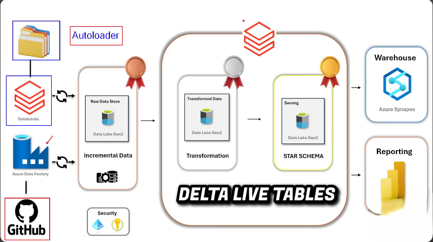
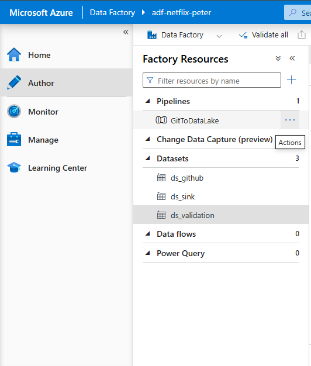
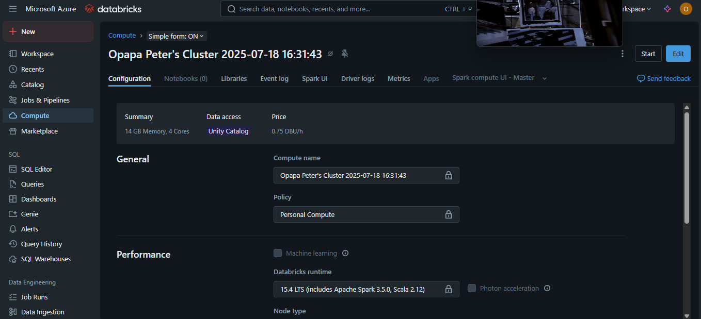
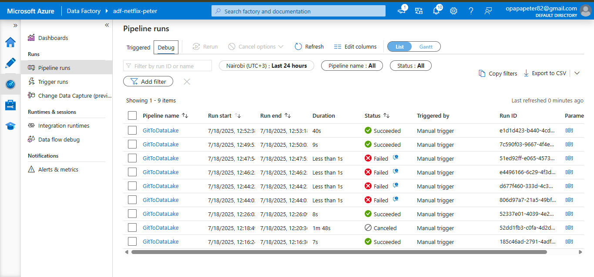

# Architecture Deep Dive

## System Architecture

The Netflix Data Pipeline implements a modern **Medallion Architecture** (Bronze → Silver → Gold) using Azure cloud services. This document provides detailed technical insights into the system design.



## Data Flow Architecture

### 1. Data Ingestion Layer (Azure Data Factory)



**Components:**
- **Source System**: GitHub repositories containing Netflix CSV datasets
- **Orchestration**: Azure Data Factory pipelines with ForEach activities
- **Validation**: Data integrity checks and schema validation
- **Target**: Azure Data Lake Storage Gen2 (Bronze layer)

**Key Features:**
- Parallel processing of multiple files using ForEach activities
- Error handling and retry mechanisms
- Data lineage tracking
- Schedule-based and event-driven triggers

### 2. Raw Data Storage (Bronze Layer)

**Technology**: Azure Data Lake Storage Gen2 with hierarchical namespace

**Structure:**
```
adls-gen2-container/
├── bronze/
│   ├── netflix_titles/
│   ├── netflix_cast/
│   ├── netflix_directors/
│   ├── netflix_countries/
│   └── netflix_categories/
```

**Features:**
- Immutable raw data storage
- Full audit trail and data lineage
- Schema evolution support
- Cost-effective storage with lifecycle policies

### 3. Stream Processing (Databricks Autoloader)



**Autoloader Configuration:**
- **Format**: CloudFiles with CSV format
- **Schema Evolution**: Automatic schema inference and evolution
- **Checkpointing**: Maintains processing state for fault tolerance
- **Incremental Processing**: Only processes new/changed files

**Benefits:**
- Near real-time data processing
- Automatic schema discovery
- Scalable stream processing
- Cost optimization through incremental loading

### 4. Data Transformation (Silver Layer)

**Technology**: Databricks with Delta Lake

**Transformations:**
- Data cleansing and standardization
- Null value handling and validation
- Data type conversion and formatting
- Deduplication logic
- Reference data normalization

**Output Tables:**
- `netflix_titles_clean`: Main fact table
- `netflix_cast_lookup`: Normalized cast relationships
- `netflix_directors_lookup`: Director relationships
- `netflix_countries_lookup`: Geographic relationships
- `netflix_categories_lookup`: Genre classifications

### 5. Business Logic (Gold Layer)

**Purpose**: Analytics-ready data marts

**Aggregations:**
- Content metrics by country and year
- Genre popularity trends
- Cast and director collaboration networks
- Content performance indicators
- Time-series analysis datasets

## Technical Implementation Details

### Delta Lake Features
- **ACID Transactions**: Ensures data consistency
- **Time Travel**: Historical data versioning
- **Schema Evolution**: Automatic schema changes
- **Optimizations**: Z-ordering and compaction
- **Concurrent Access**: Multiple readers/writers support

### Performance Optimizations
- **Partitioning Strategy**: Date-based partitioning for time-series data
- **Caching**: Strategic DataFrame caching for iterative operations
- **Broadcasting**: Efficient joins with broadcast variables
- **Adaptive Query Execution**: Spark AQE for dynamic optimization

### Security and Governance
- **Managed Identity**: Azure AD integration for secure access
- **RBAC**: Role-based access control for data layers
- **Data Encryption**: End-to-end encryption at rest and in transit
- **Audit Logging**: Comprehensive activity logging

## Monitoring and Observability

### Pipeline Monitoring


**Metrics Tracked:**
- Data volume processed
- Processing latency
- Error rates and types
- Resource utilization
- Cost per execution

**Alerting:**
- Pipeline failure notifications
- Data quality threshold breaches
- Performance degradation alerts
- Cost threshold warnings

### Data Quality Monitoring
- Row count validation
- Schema drift detection
- Data freshness checks
- Business rule validation
- Anomaly detection

## Scalability Considerations

### Horizontal Scaling
- Auto-scaling Databricks clusters (1-8 workers)
- Parallel ADF pipeline execution
- Distributed Delta Lake storage

### Vertical Scaling
- Dynamic cluster sizing based on workload
- Memory-optimized instances for large datasets
- SSD storage for high-throughput operations

### Cost Optimization
- Spot instances for non-critical workloads
- Automatic cluster termination
- Storage tiering (Hot/Cool/Archive)
- Resource tagging for cost allocation

## Disaster Recovery

### Backup Strategy
- Cross-region replication for ADLS Gen2
- Delta Lake time travel for point-in-time recovery
- Infrastructure as Code for environment recreation

### Recovery Procedures
- Automated failover mechanisms
- Data consistency checks post-recovery
- Rollback procedures for failed deployments

This architecture provides a robust, scalable, and cost-effective solution for processing Netflix data at enterprise scale.
